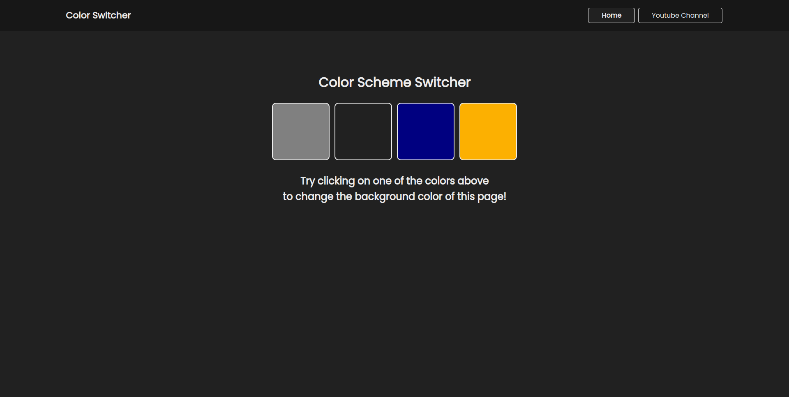

# Color Switcher

### Color switcher is a mini project were we can can background color of by clicking on one of the four boxes i.e. grey, black, blue & yellow.

## Key Notes -

### forEach, addEventListener